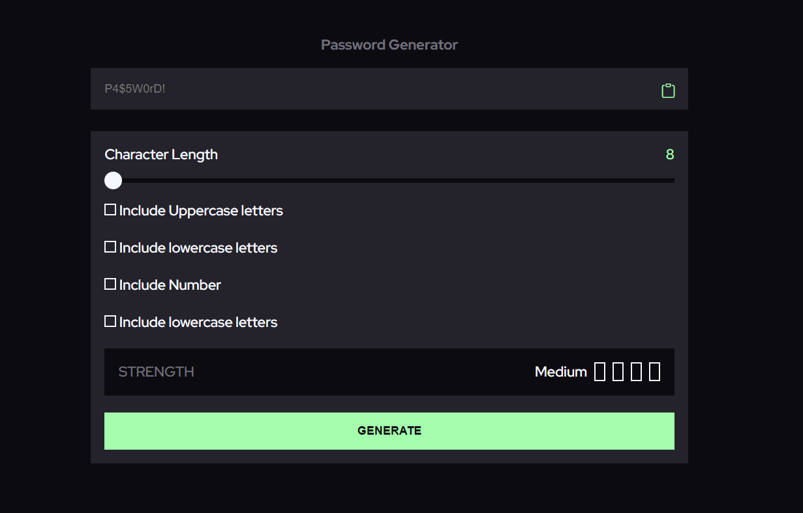

# Password Generator

## Table of contents

- [Overview](#overview)
  - [The challenge](#the-challenge)
  - [Screenshot](#screenshot)
  - [Links](#links)
- [My process](#my-process)
  - [Built with](#built-with)
- [Author](#author)

## Overview
this page is to show a password generator aplication.

### Screenshot

### Links

- Solution URL: [https://github.com/ivargasm/password-generator](https://github.com/ivargasm/password-generator)
- Live Site URL: [https://password-generator-iota-ashy.vercel.app/](https://password-generator-iota-ashy.vercel.app/)

## My process

First generate the layout with HTML and CSS and JS.

### Built with

- Semantic HTML5 markup
- CSS custom properties
- Flexbox
- CSS Grid
- Mobile-first workflow

## Author

- Website - [Curriculum](https://ivargasm.com)
- Website - [Projects](https://ismaelvm.xyz)
